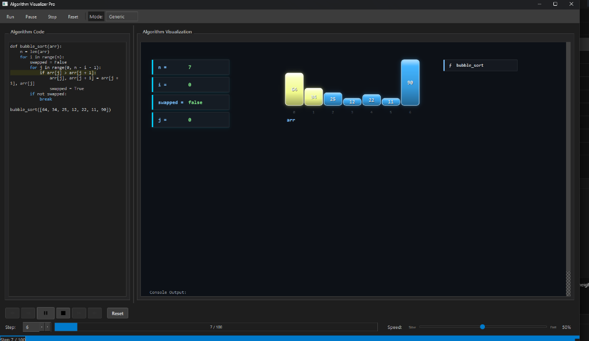
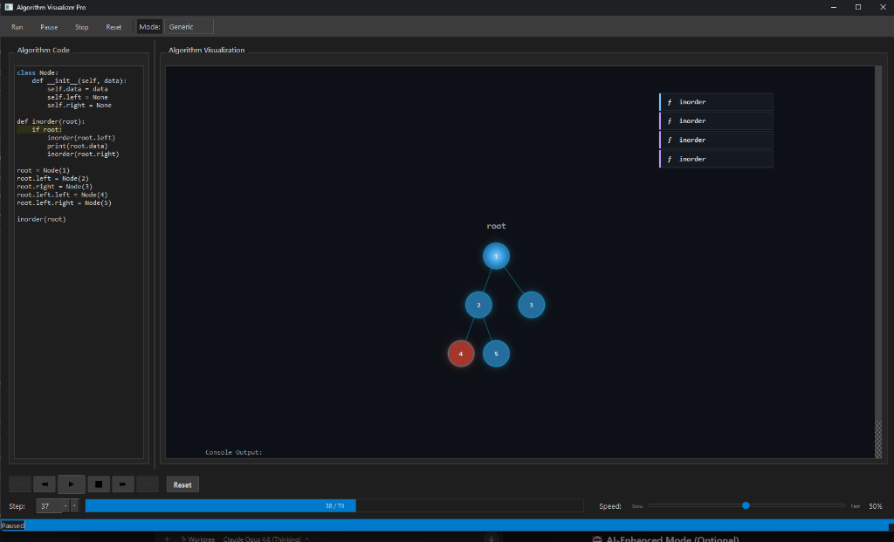

<p align="center">
  <h1 align="center">Algorithm Visualizer Pro</h1>
  <p align="center">
    <strong>A cinematic, step-by-step algorithm visualization desktop app</strong><br>
    Write Python algorithms → Watch them execute with rich, animated graphics
  </p>
</p>

<p align="center">
  
  
  

  
</p>

---

## 📸 Screenshots

<p align="center">
  
  <br>
  <em>Bubble Sort — Proportional bars with variable cards, compare highlighting, and call stack</em>
</p>

<p align="center">
  
  <br>
  <em>Binary Tree Inorder Traversal — Auto-detected tree layout with recursive call stack tracking</em>
</p>

---

## ✨ Features

- **Live Code Execution** — Write Python in the built-in editor and trace every line
- **Rich Visualizations** — Arrays, graphs, trees, stacks, queues, and variables rendered with premium cyberpunk-inspired graphics
- **Sorting Animations** — Proportional-height bars with smooth swap/compare animations
- **Graph Traversal** — Circular node layouts with visited/frontier/path coloring and draggable nodes
- **Binary Tree Rendering** — Auto-detected tree structures with centered recursive layout
- **Stack & Queue Views** — Vertical stack and horizontal queue with directional markers
- **Media Player Controls** — Play, pause, step forward/backward, go-to-step, adjustable speed
- **Syntax Highlighting** — VS Code Dark+ inspired code editor with active line tracking

- **Smart Auto-Detection** — Heuristics automatically identify sorting, graph, tree, and recursive algorithms

---

## 🏗️ Architecture

```
┌─────────────────────────────────────────────────────────┐
│                    Qt/C++ Frontend                       │
│  ┌──────────┐  ┌───────────────┐  ┌──────────────────┐  │
│  │  Code    │  │  ASTVisualizer │  │  Control Panel   │  │
│  │  Editor  │  │  (Rendering)   │  │  (Playback)      │  │
│  └──────────┘  └───────┬───────┘  └──────────────────┘  │
│                        │                                 │
│              ┌─────────▼─────────┐                       │
│              │  QGraphicsScene   │                       │
│              │  Arrays │ Graphs  │                       │
│              │  Trees  │ Vars    │                       │
│              └───────────────────┘                       │
└──────────────────┬──────────────────────────────────────┘
                   │ QProcess (JSON over stdout)
        ┌──────────▼──────────┐
        │  Python Tracer      │
        │  sys.settrace()     │
        │  → JSON timeline    │
        └─────────────────────┘
```

The app follows a **record-then-play** model:

1. **Record** — Python tracer captures every line execution, variable state, and call stack frame
2. **Transfer** — Execution timeline serialized as JSON and sent to C++ via stdout
3. **Play** — QTimer-driven playback steps through frames with animated rendering

---

## 📁 Project Structure

```
AlgorithmVisualizaion/
├── main.cpp                    # Application entry point
├── mainwindow.cpp / .h         # Main window — UI layout, toolbar, orchestration
├── ASTVisualizer.cpp / .h      # Core visualization engine (arrays, graphs, trees, variables)
├── mainwindow.ui               # Qt Designer form
├── CMakeLists.txt              # Build configuration (Qt6, C++17)
├── Widgets/
│   ├── control_panel.cpp / .h  # Playback controls (play/pause/step/speed)
│   └── code_highlighter.cpp/.h # Syntax highlighting + line tracking
└── build/
    └── .../python_tracer.py    # Python execution tracer (sys.settrace)
```

### Key Components

| Component | File | Responsibility |
|-----------|------|----------------|
| **MainWindow** | `mainwindow.cpp` | UI shell, process management, signal wiring |
| **ASTVisualizer** | `ASTVisualizer.cpp` | Parses JSON steps, renders visual items, manages scene |
| **Python Tracer** | `python_tracer.py` | Hooks into Python interpreter, captures execution timeline |
| **ControlPanel** | `Widgets/control_panel.cpp` | Media-player-style playback controls |
| **CodeHighlighter** | `Widgets/code_highlighter.cpp` | VS Code-style syntax highlighting |

---

## 🚀 Getting Started

### Prerequisites

- **Qt 6.9+** with Widgets and Network modules
- **CMake 3.16+**
- **C++17** compatible compiler (MinGW, MSVC, GCC, Clang)
- **Python 3.x** installed and accessible via `python` on PATH

### Build

```bash
# Clone the repository
git clone https://github.com/VishwaPriyan-S/AlgorithmVisualization.git
cd AlgorithmVisualization

# Configure with CMake
cmake -B build -DCMAKE_PREFIX_PATH=<path-to-qt>

# Build
cmake --build build
```

Or open the project directly in **Qt Creator** and build from there.

### Run

```bash
./build/AlgorithmVisualizaion
```

> **Note:** Ensure `python_tracer.py` is accessible. The app searches the application directory, working directory, and parent/build folders automatically.

---

## 📖 Usage

### Basic Workflow

1. **Write or paste** a Python algorithm in the left-side code editor
2. **Select a mode** from the toolbar dropdown (Generic, Sorting, Recursion, Graph) — or leave it on Generic for auto-detection
3. **Click Run** — the tracer executes your code and records every state
4. **Watch the visualization** play back automatically, or use the controls to step through manually

### Playback Controls

| Control | Action |
|---------|--------|
| ▶ / ⏸ | Play / Pause automatic stepping |
| ⏹ | Stop execution |
| ⏩ | Step forward one frame |
| ⏪ | Step backward one frame |
| ⏮ | Jump to beginning |
| ⏭ | Jump to end |
| Speed Slider | Adjust playback speed (50ms – 2000ms per step) |
| Step Spinner | Jump to a specific step number |

### Example: Bubble Sort

```python
def bubble_sort(arr):
    n = len(arr)
    for i in range(n):
        swapped = False
        for j in range(0, n - i - 1):
            if arr[j] > arr[j + 1]:
                arr[j], arr[j + 1] = arr[j + 1], arr[j]
                swapped = True
        if not swapped:
            break

bubble_sort([64, 34, 25, 12, 22, 11, 90])
```

<p align="center">
  
</p>

### Example: BFS Graph Traversal

```python
graph = {
    'A': ['B', 'C'],
    'B': ['D', 'E'],
    'C': ['F'],
    'D': [],
    'E': [],
    'F': []
}

visited = []
queue = ['A']

while queue:
    node = queue.pop(0)
    if node not in visited:
        visited.append(node)
        for neighbor in graph[node]:
            queue.append(neighbor)
```

Nodes are arranged in a circular layout with color-coded traversal state (visited = green, frontier = pink, current = hot pink).

### Example: Binary Tree Traversal

```python
class Node:
    def __init__(self, data):
        self.data = data
        self.left = None
        self.right = None

def inorder(root):
    if root:
        inorder(root.left)
        print(root.data)
        inorder(root.right)

root = Node(1)
root.left = Node(2)
root.right = Node(3)
root.left.left = Node(4)
root.left.right = Node(5)

inorder(root)
```

<p align="center">
  
</p>

---

## 🎨 Visual Design

The app uses a **VS Code Dark+** inspired theme with cyberpunk accents:

| Element | Color | Hex |
|---------|-------|-----|
| Background | Dark charcoal | `#1e1e1e` |
| Scene background | Deep navy | `#0d1117` |
| Primary accent | Neon cyan | `#00d4ff` |
| Highlight / Active | Hot pink | `#ff79c6` |
| Sorted / Visited | Neon green | `#50fa7b` |
| Compare indices | Neon yellow | `#f1fa8c` |
| Path / Depth | Neon purple | `#bd93f9` |
| Status bar | VS Code blue | `#007acc` |

Visual items feature:
- **4-stop cyberpunk gradients** on bars
- **Radial gradients** on graph/tree nodes
- **Neon glow borders** and drop shadows
- **Smooth `QPropertyAnimation`** transitions with `OutCubic` easing

---

## 🛠️ Technical Details

- **Build System:** CMake with `qt_add_executable`
- **Qt Modules:** Widgets (UI), Network
- **C++ Standard:** C++17
- **Python Integration:** `QProcess` spawning isolated Python interpreter
- **Rendering:** `QGraphicsScene` / `QGraphicsView` with antialiasing
- **Animations:** `QPropertyAnimation` + `QParallelAnimationGroup`

---

## 📄 License

This project is open source. See the [LICENSE](LICENSE) file for details.

---

<p align="center">
  Built with ❤️ using Qt and Python
</p>
